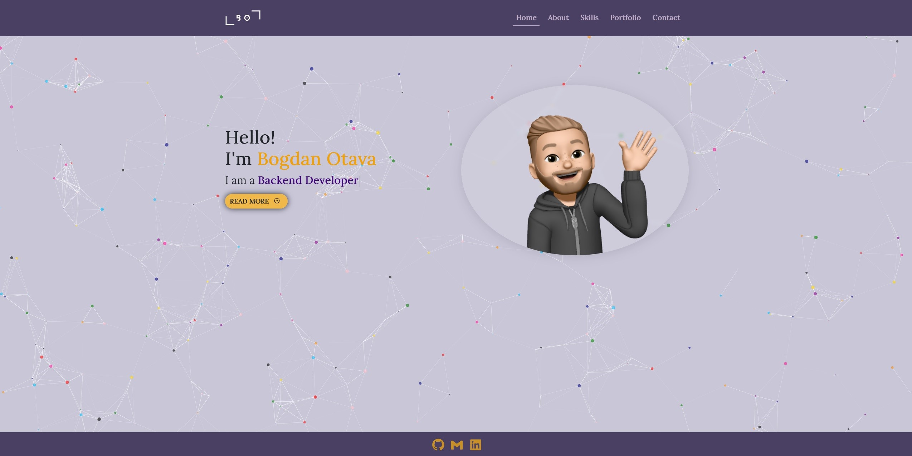
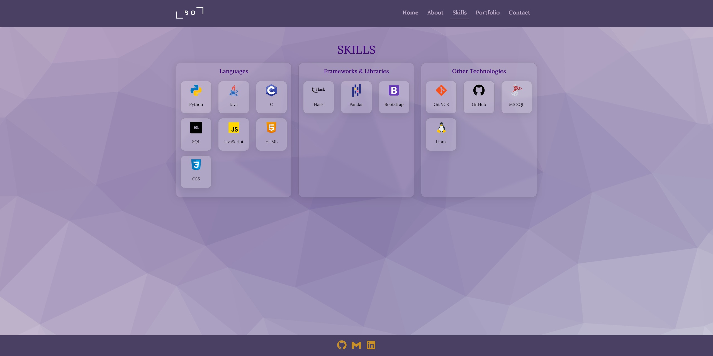

        

---

## :clapper: **Presentation Video**

- **[YouTube Link]()**

---

## :label: **Description**

This portfolio website serves as the culmination of my journey through CS50x - Introduction to Computer Science. It was built using a blend of technologies and frameworks, and it showcases some of the skills I accumulated during this course. 

Using HTML, CSS and JavaScript, coupled with frameworks such as Bootstrap, the website adapts seamlessly to various screen sizes and devices. The visual appearance is further enhanced by libraries such as typed.js, particles.js and trianglify. 

Behind the scenes, the website is powered by Python and Flask, which handles the requests, processes data and interacts with the necessary APIs. One of the highlights of the project is the integration of the GitHub API, which grants it dynamic functionality. Upon loading the website, the API efficiently retrieves all the public repositories from my profile, ensuring up to date information of my latest coding ventures. 

To optimize the performance and reduce server load, the website is using server-side caching, by storing frequently accessed data in the server memory or disk storage, this minimizing processing time and enhancing responsiveness. On the client-side, caching is utilized to store and retrieve static assets, such as images, stylesheets, and scripts. This enables faster loads, as the browser can retrieve these assets from the local cache instead of making additional network requests.

By implementing both server-side and client-side caching, this portfolio website strikes a balance between delivering dynamic and up to date content while optimizing performance and reducing latency.

---

## :eyes: **Sneak Preview**

---

## :exclamation: **Dependencies**

- [typed.js](https://github.com/mattboldt/typed.js/) - JavaScript library that provides the typewriter-like animation.
- [particles.js](https://vincentgarreau.com/particles.js/) - JavaScript library used for the partcile animation.
- [trianglify](https://trianglify.io/) - JavaScript library used to create triangle-based patterns.
- [Loading Effect](https://codepen.io/dissimulate/pen/nmJyyg) - Code snippet for the Loading effect.

---

## :green_book: **Future Enhancements**

- functional contact form, that visitors can use to contact me.
- integrating Google reCAPTCHA to prevent spam submisions and improve security.
- implementing Google Analytics for tracking and analyzing website performance.
- feedback button for leaving feedback about the website.
